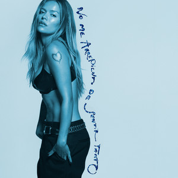

<header class="principal__cabecera">
    
    
    

      Sencillo
      <h1 class="principal__titulo">Terminal 2F</h1>
      
      

        GIMS
        •
        Dadju
        •
        2024
        •
        1 canción, 3 min 7 s
      

    

  </header>

  <!-- Contenedor inferior con fondo degradado a negro -->
  

    <!-- 2. Barra de acciones -->
    <section class="principal__acciones">
      

        <button class="principal__boton-reproducir" type="button" aria-label="Reproducir">
          <svg width="24" height="24" viewBox="0 0 24 24" fill="currentColor"><path d="M8 5.14v14l11-7-11-7z"/></svg>
        </button>
        <button class="principal__boton principal__boton--atenuado" type="button" aria-label="Aleatorio">
          <svg width="20" height="20" viewBox="0 0 24 24" fill="none" stroke="currentColor" stroke-width="2" stroke-linecap="round" stroke-linejoin="round"><path d="M16 3h5v5M4 20l17-17M21 16v5h-5M15 15l6 6M4 4l5 5"/></svg>
        </button>
        <button class="principal__boton principal__boton--atenuado" type="button" aria-label="Guardar">
          <svg width="20" height="20" viewBox="0 0 24 24" fill="none" stroke="currentColor" stroke-width="2" stroke-linecap="round" stroke-linejoin="round"><circle cx="12" cy="12" r="10"/><line x1="12" y1="8" x2="12" y2="16"/><line x1="8" y1="12" x2="16" y2="12"/></svg>
        </button>
        <button class="principal__boton principal__boton--atenuado" type="button" aria-label="Descargar">
          <svg width="20" height="20" viewBox="0 0 24 24" fill="none" stroke="currentColor" stroke-width="2" stroke-linecap="round" stroke-linejoin="round"><circle cx="12" cy="12" r="10"/><path d="m8 12 4 4 4-4"/><line x1="12" y1="8" x2="12" y2="16"/></svg>
        </button>
        <button class="principal__boton principal__boton--atenuado" type="button" aria-label="Más opciones">
          <svg width="20" height="20" viewBox="0 0 24 24" fill="currentColor"><circle cx="5" cy="12" r="2"/><circle cx="12" cy="12" r="2"/><circle cx="19" cy="12" r="2"/></svg>
        </button>
      

      

        <button class="principal__boton-vista" type="button">
          Lista
          <svg width="16" height="16" viewBox="0 0 24 24" fill="none" stroke="currentColor" stroke-width="2"><line x1="8" y1="6" x2="21" y2="6"/><line x1="8" y1="12" x2="21" y2="12"/><line x1="8" y1="18" x2="21" y2="18"/><line x1="3" y1="6" x2="3.01" y2="6"/><line x1="3" y1="12" x2="3.01" y2="12"/><line x1="3" y1="18" x2="3.01" y2="18"/></svg>
        </button>
      

    </section>

    <!-- 3. Lista / Tabla de canciones -->
    <section class="tabla-pistas">
      

        #
        Título
        
          <svg width="16" height="16" viewBox="0 0 24 24" fill="none" stroke="currentColor" stroke-width="2"><circle cx="12" cy="12" r="10"/><polyline points="12 6 12 12 16 14"/></svg>
        
      

      

        

          1
          <button class="tabla-pistas__play-hover" type="button" aria-label="Reproducir">
            <svg width="16" height="16" viewBox="0 0 24 24" fill="currentColor"><path d="M8 5v14l11-7z"/></svg>
          </button>
        

        

          Terminal 2F
          GIMS, Dadju
        

        3:07
      

    </section>

    <!-- 4. Créditos / Legal -->
    <section class="principal__creditos">
      
16 de agosto de 2024

      
© 2024 GÉANTE ROUGE

      
℗ 2024 GÉANTE ROUGE

    </section>

    <!-- 5. Más de GIMS (Tarjetas) -->
    <section class="discografia">
      

        <h2 class="discografia__titulo">Más de GIMS</h2>
        <a class="discografia__enlace" href="#">Ver discografía</a>
      

      

        <article class="tarjeta-album">
          

            
          

          <h3 class="tarjeta-album__titulo">LE NORD SE SOUVIENT</h3>
          2024 • Álbum
        </article>

        <article class="tarjeta-album">
          

            
          

          <h3 class="tarjeta-album__titulo">LE NORD SE SOUVIENT</h3>
          2024 • Álbum
        </article>

        <article class="tarjeta-album">
          

            
          

          <h3 class="tarjeta-album__titulo">Subliminal (La face...</h3>
          2013 • Álbum
        </article>

        <article class="tarjeta-album">
          

            
          

          <h3 class="tarjeta-album__titulo">Soleil</h3>
          2024 • Sencillo
        </article>
      

    </section>

  
